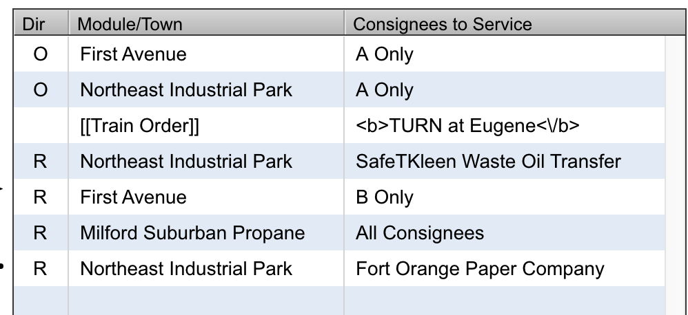
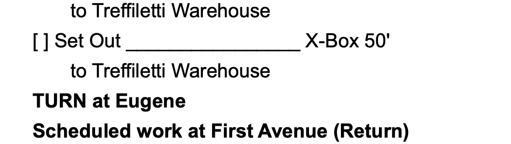

# Route train orders

Train orders are 1 line comments that can be added to a train's route. Train orders are setup on the train edit screen. A train order can be used to provide instructions to a crew. Train orders are output on all trainlists generated for the train.

## Add train order to train route

To add a train order to the route, follow these steps:

1. Go to the train route screen and select the `Train Orders` tab located next to `Modules/Towns`. This will display a list of all train orders.
2. Click once on the line corresponding to the train order you wish to add.
3. Click on the line above where you want to insert the train order into the route.
4. Click the right arrow located in the center of the train route screen.

This action will insert the train order into the train's route below the selected line. Each trainlist generated will now include the train order in the specified sequence on the route.

## Train orders will not update once added to route

The format and content of a train order are established when adding the order to the train route. Any subsequent changes made to the order on the train edit screen will not automatically update the route.

To update the modified train order in the route, you must first remove the order from the route. Then, you can add the modified order in the same line previously occupied by the removed train order.

## Train order example - indicating where to turn

If a train is a turn with the intention that a turn take place at a specific location, a train order can be added to a train's route to notify the crew where the turn should take place.

By adding `<b>TURN at Eugene</b>` to a train order, this line can be added to the train's route at the position in the sequence where the turn should take place.



This train route is rendered on the trainlist as follows:



The trainlist will display the train order text each time a trainlist is generated.

## Train order example - special instructions

Train orders can communicate special instructions to a crew at a specific point in the route sequence. As an example the crew could be informed of a set out of a transfer cut of cars that will be worked by a different crew. Train orders could be created as follows:

```
<b>Scheduled Transfer at Woodstown Junction</b>
[ ] Set out Lackawanna Local transfer cut
[ ] Pick up all
    to Transfer Track 1
    from Transfer Track 1
```

These instructions can be added to a train route at the point in the sequence where the transfer would take place. The text is formatted in a manner that it will blend in with other instructions on the trainlist. The order of the instructions does not matter as each individual line can be added to the route in any sequence. It is also possible to adjust the train order sequence using the up and down arrows if needed.

The above train orders on a train's route may look like this:


When a trainlist is generated, the trains route will appear as follows:


Notice how the train order lines instructing to "Set out Lackawanna Local transfer cut to Transfer Track 1" are formatted similarly to other instructions on the trainlist. This formatting consistency occurs because when the train orders were entered on the train edit screen, they were formatted to match the output of a ModuOps trainlist.

These train orders are listed sequentially after the United Steel Corporation instructions and before the Woodstown Junction B Only instructions matching the sequence found on the train's route.

:::info
Under ModuOps random selection scheduling, there's a chance that modules, towns, or consignees on the train route might not be chosen. Consequently, if United Steel isn't selected, the crew would first work the transfer.

Similarly, if no Woodstown Junction B Only consignees are selected, the train's next stop would be something other than Woodstown Junction.
:::
