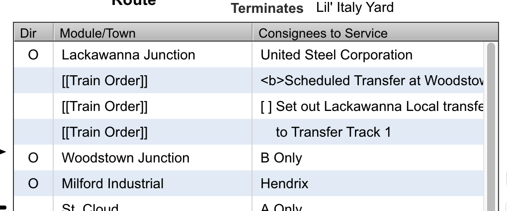
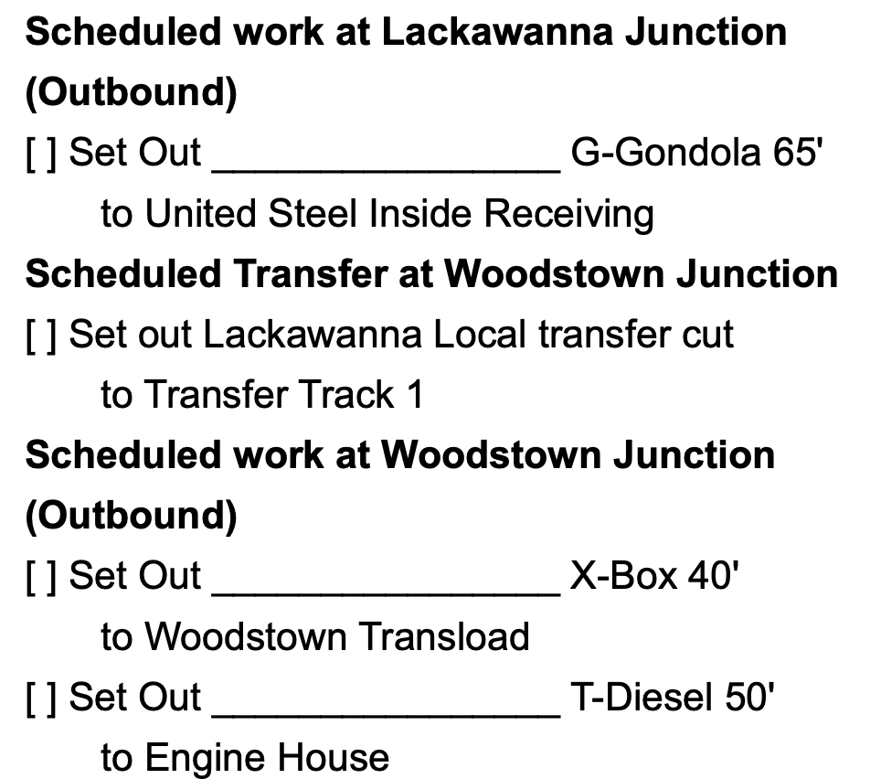

# Trains

The train screen is where you handle all aspects related to trains on your layout. A train comprises equipment that is randomly chosen from the equipment requests made by consignees on the train's route.

Editing Train Information

Trains contain various details regarding their characteristics, such as symbols, names, departure, and terminating points.

To create a new train, simply click the New button on the train management screen.

To edit an existing train, follow these steps:

1. Select the desired train from the train list.
2. Click the `Edit` button on the train management screen.

## Train fields

**Symbol (required)** - the identifier of the train.

**Type** - a menu offering various classifications of the train. Currently there is no use for types in the application. The option is provided as a means for documentation only.

**Departure (required)** - the yard the train will depart from.

**Terminates (required)** - the yard the train will terminate at.

**Length (required)** - the length of the train intended to be in feet. This value is the maximum length a train could potentially be. The ModuOps scheduler will create a train up to this length but not longer.

:::tip
The length of a train is for equipment only. The length of power and vans should not be included in this value.
:::

:::note
The unit of measure is arbitrary and technically this value can represent any unit needed. However you must be sure that the unit is consistent with the length of equipment and drop zones.
:::

**Minimum length** - the minimum length a train can be. When there is a value in this field, the ModuOps scheduler will select a random number between and including the minimum length and the maximum length.

:::info
ModuOps algorithms build trains up to but not exceeding the minimum length. Consequently, you will see train lengths that are less then the minimum.
:::

**Name** - the name of the train

**Remark** - additional comment about the train. Currently the remark is provided as a means for documentation only and is not used anywhere in the application.

**Limit modules** - the maximum number of modules/towns a train can service in 1 trip. This is useful in situations where a train's route may take it across several modules/towns but is desired to limit the work done to a subset of all the modules/towns. The modules/towns are randomly selected from the modules/towns on equipment orders based on the scheduling engine being used.

## Additional instructions

### Job Overview

A field for describing the job the crew of this train will perform. Currently this field is provided for documentation only and is not used anywhere in the application.

### Crew Instructions

A field describing specific instructions to the crew operating this train. Crew instructions are printed at the top of trainlists after the details of the train. Crew instructions are a way to give overall instructions to the crew for operating this train.

:::tip
Most fields in ModuOps allow for basic html formatting. As an example, enclosing text between `<b></b>` causes the text to be formatted as bold text.

`<b>PICKUP ALL WHEN DROPPING</b>` is a common instruction to add to the crew instructions. This will be rendered as **PICKUP ALL WHEN DROPPING** on trainlists.
:::

### Termination instructions

A field typically containing instructions for the crew of a train on procedures for terminating the train. This can include instructions for returning motive power to a certain track or perhaps even a shutdown procedure for the locomotive.

This field is added to all trainlists generated for this train after all work instructions but before the train termination location line.

**Example termination instructions**

```
<b>Scheduled Work Harris Yard</b>
[ ] Terminate Track 1 Harris Yard
```

### Train Orders

The train orders field is available for additional information or instructions that can be added to a train's route. Each line within this field can be added to a train route. For instance, with a train order, you can direct a crew where they should turn, such as <b>TURN at St. Cloud</b>.

Train orders seamlessly integrate with the train's route instructions. While mastering this technique may require some practice, it's not overly complex. By employing basic HTML, including `<b></b>` to make text bold, indenting and simple formatting of orders, it's possible to blend train orders with other route instructions.

**Train order example**

We will create a series of train orders for the crew to set out a cut of cars on the outbound journey and pick up a transfer cut on the return, set out by a branch crew.

The initial step is to create a train order that designates the start of this work at a specific module or town location.

`<b>Scheduled Transfer at Woodstown Junction</b>`

When the above is rendered the text will be bold just as other module headings appear on a printed trainlist.

:::tip
Basic html formatting can be used on train orders. This allows you to match the formatting of a trainlist so the train order blends in with other route instructions.

`<b></b>` any text between these tags will be bold

`<i></i>` any text between these tags will be italic
:::

Next we need 2 orders to set out and pick up the transfer cut of cars. Our crew in this example is working a turn. On the way out the crew will set out a cut of cars at the transfer location. On the return of the turn, the crew will pick up a cut of cars left at the transfer location by a local branch crew.

```
[ ] Set out Lackawanna Local transfer cut
[ ] Pick up all
```

The instructions above provide a space for the crew to add a checkmark when the task is completed just like other tasks would have on the trainlist.

Finally we need to add additional details on where the transfer cut is to be set out and picked up.

```
    to Transfer Track 1
    from Transfer Track 1
```

It is a little difficult to see but these lines are indented the same spacing as the 2nd line of a trainlist would be. This allows the train order text to blend in with other text on the trainlist.

The finale train order field for our example looks like:

```
<b>TURN at St. Cloud</b>
<b>Scheduled Transfer at Woodstown Junction</b>
[ ] Set out Lackawanna Local transfer cut
[ ] Pick up all
    to Transfer Track 1
    from Transfer Track 1
```

Each of these lines is available on the train route screen to be added to the train's route. Details on how to do this are in the section below for describing the features related to train routes.

## Train route

Select a train on the train list screen and click the `Route` button navigates to the train route screen. You can also double click a train to navigate to the train route screen.

The train route screen displays the train name and symbol over the train's route. Initially a train's route will not have any stops. The departure and termination yards are displayed as well.

### Overview of routes

A train's route is displayed from top to bottom, listing the modules/towns, consignees or train orders in sequence. Each step in the train's route represents the intended order of movement for the train. The first line signifies the initial module/town, consignee or train order the train encounters.

Train route items are arranged in chronological order. Work is randomly selected based on the information provided in the train's route. When a trainlist is printed, the order of items on the train list mirrors the order of items on the train's route.

:::note
ModuOps randomly selects equipment requests from all available requests that make up a train's route. It is possible that a line on a trains route will not have a corresponding line on the trainlist if no work was selected for that module/town or consignee.
:::

### Adding a Module/Town to the route

On the left side of the screen is a list of all the modules/towns in the layout. There is also a tab to select train orders entered on the train's edit screen.

Clicking a module selects the module in the list. Click the right arrow in the center of the window to add this module/town to the train's route. The default setting is to service all consignees when a module/town is added to a train's route.

### Select Consignees based on trailing spur direction

It is possible to select a sub set of consignees to service as well. After selecting a module/town, in the lower left of the train route screen there is a menu labeled `Select Consignee`.

**Select `A` consignees**

1. Click to select a module/town from the list on the train route screen.
2. Click the `Select Consignee` menu and select `A Only`. This will show all the consignees that have an `A` facing drop zone.
3. Click the right arrow in the center of the screen to add all `A Only` consignees to the train's route.

**Select `B` consignees**

1. Click to select a module/town from the list on the train route screen.
2. Click the `Select Consignee` menu and select `B Only`. This will show all the consignees that have an `B` facing drop zone.
3. Click the right arrow in the center of the screen to add all `B Only` consignees to the train's route.

:::tip
Drop zone directions of `A` or `B` facing is set on the drop zone edit screen. Please refer to the modules/towns documentation to learn how to set this value.
:::

This instruction on the train's route informs the scheduling engine when generating the trainlist for this train, at this sequence in the train's route, only consignees facing either the `A` or `B` direction should be selected for work (based on the direction chosen in the menu).

### Service specific consignee(s) only

It is possible to select an individual consignee to service on the train's route. ModuOps provides the flexibility to allow for unique route options.

1. Click to select a module/town on the train route screen.
2. Click the `Select Consignee` menu and select `A Only`. This will show all the consignees that have an `A` facing drop zone.
3. Select a consignee from the `A Only` list to highlight the line on the bottom left of the train route screen.
4. Click the right arrow in the center of the screen to add that specific consignee to the train's route.

If the train's route needs to have a `B` facing consignee, the same procedure is followed except that you will select `B Only` in the `Select Consignee` menu.

:::tip
Be sure that all drop zones are defined with either an `A` or `B` direction. If drop zone does not have a direction defined, you will not be able to
:::

### No service for consignee

The are times when a train may not want to service a specific consignee. Perhaps the consignee is a grain elevator that is serviced by a grain unit train instead of a local turn. You can indicate on a train's route that a specific consignee should not be serviced.

1. Select a module/town on the train route screen.
2. Select "No Service" from the `Select Consignee` menu on the bottom left of the screen. A list of all the consignees are displayed.
3. Select the consignee that should not be serviced by this train and click the right arrow in the center of the screen.

A special instruction is added to the train's route indicating that the consignee should not be serviced.

### Direction indicator

ModuOps train routes are able to add a direction indication on when a consignee should be serviced. This can be used to provide additional information to the train's crew to assist them with performing their work.

1. Select a module/town on the train route screen.
2. Click the `Direction` menu on the bottom left of train route screen.
3. Select `Outbound` from the list of available directions.
4. Select either `A Only` or `B only` in the `Select Consignee` menu on the bottom left of train route screen. In most cases the direction indication is used in conjunction the facing direction of drop zones such that only trailing drops are scheduled in the direction of travel that was selected.
5. Click the right arrow in the center of the screen to add the module/town to the train's route.

You will notice the train's route has an `O` in the `Dir` column. This has the effect of printing `(Outbound)` on the trainlist when this module/town is selected to be worked.

:::info
Modules are arranged in a layout where drop zones face either the A or B direction, indicating which way the drop zone trails. The orientation varies from module to module.

Typically a train's route will feature modules with drop zones oriented such that some may have `A` as trailing while others will have `B` as trailing. This arrangement is normal and expected.
:::

### Reorder route stops

A train's route are the sequence of stops and work a trainlist will output depending on what is selected by the scheduling engine. It is possible to reorder the stops by selecting a line in the train's route and clicking the `up` and `down` buttons on the right side of train route screen.

The selected line will move up or down depending on which button is pressed. This has the effect of reordering the stop to happen either earlier or later in the train's sequence of stops/work.

### Remove a route stop

To remove a stop on a train route, select the line in the route that you would like to remove. Click the left arrow in the center of the screen. This will remove the stop from the train's route.

### Train orders

Train orders are 1 line comments that can be added to a train's route. Train orders are setup on the train edit screen. A train order can be used to provide instructions to a crew. Train orders are output on all trainlists generated for the train.

On the train route screen, click the `Train Orders` tab next to `Modules/Towns`. A list displaying all the train orders is displayed. To add a train order to a train's route, click once on the line that you would like to add to the route. Now on the train route list, click the line above where you would like the train order to be added to the route.

Click the right arrow in the center of the train route screen. This will add the train order to the train's route below the selected line in the route. Every trainlist generated will contain the train order added based on the sequence as listed on the route.

#### Train orders will not update once added to route

The format and content of a train order are determined when the order is added to the train route. Any changes made to the order won't automatically update the route. To update the train order, you need to remove it from the route and then add the modified version.

#### Train order example - indicating where to turn

If a train is a turn with the intention that a turn take place at a specific location, a train order can be added to a train's route to notify the crew where the turn should take place.

By adding `<b>TURN at Eugene</b>` to a train order, this line can be added to the train's route at the position in the sequence where the turn should take place. The trainlist will display the text each time a trainlist is generated.

#### Train order example - special instructions

Train orders can communicate special instructions to a crew at a specific point in the route sequence. As an example the crew could be informed of a set out of a transfer cut of cars that will be worked by a different crew. Train orders could be created as follows:

```
<b>Scheduled Transfer at Woodstown Junction</b>
[ ] Set out Lackawanna Local transfer cut
[ ] Pick up all
    to Transfer Track 1
    from Transfer Track 1
```

These instructions can be added to a train route at the point in the sequence where the transfer would take place. The text is formatted in a manner that it will blend in with other instructions on the trainlist. The order of the instructions does not matter as each individual line can be added to the route in any sequence. It is also possible to adjust the train order sequence using the up and down arrows if needed.

The above train orders on a train's route may look like this:



When a trainlist is generated, the trains route will appear as follows:



Notice that the train order lines containing the instructions to "Set out Lackawanna Local transfer cut to Transfer Track 1" appear in line formatted in a similar manner to other instructions on the trainlist. The train orders appear in sequence after United Steel Corporation and before Woodstown Junction B Only instructions.

:::note
Under ModuOps random selection scheduling, there's a chance that modules, towns, or consignees on the train route might not be chosen. Consequently, if United Steel isn't selected, the crew would first work the transfer.

Similarly, if no Woodstown Junction B Only consignees are selected, the train's next stop would be something other than Woodstown Junction.
:::
