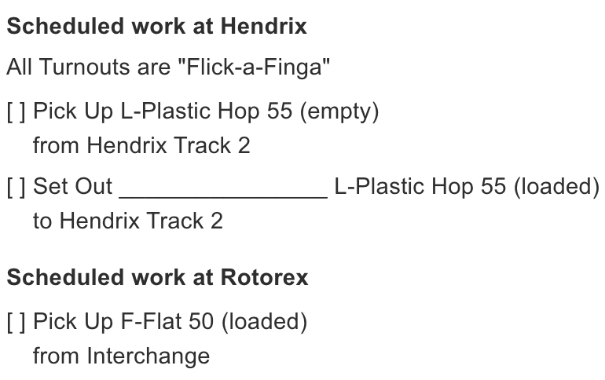

# Pull & Drop Ops

I've spent many sleepless nights trying to move ModuOps beyond drops-only with a "pick up all." That's our history -- Mad River and Big Timber never tracked condition, and ModuOps hasn't either, until now.

ModuOps is also a car-type-based pseudo-random select engine (for the most part), which made this an interesting design challenge. I wanted a scheduling engine that still handles drops as we know them, but also tracks what's been sent to each drop zone and schedules those cars to be pulled later.

What I came up with is the new "Pull & Drop Ops" scheduling engine -- with a twist...

<!-- truncate -->

## ModuOps unique features

ModuOps has two features that set it apart. First, it **doesn't care what condition the layout is in when an ops session starts** -- no need to pre-stage cars at drop zones.

Second: ModuOps started life at model train shows, where operators put on a show and chat with show-goers. **Mistakes happen**. Someone stops you mid-switching to ask a question, you chat for 10 minutes, and somehow you drop a plastic pellet hopper at a bakery that needed flour... oops!

That's ok -- ModuOps is **self-correcting**. The next crew is instructed to **PICKUP ALL** when dropping, and the mistake gets carted away.

A new engine that tracks condition had to preserve both of these.

## New scheduler in a nutshell

The Pull & Drop Ops engine schedules car types to drop zones the same way we always have: a train's route generates a list of potential equipment requests, weighted by a "demand" factor, and items are randomly selected onto the train's manifest -- printed as a train list or switchlist like always.

The first time a train visits a drop zone, the crew is instructed to "Pickup All" -- this resets the zone to a known condition. From then on, the app remembers what car types are sitting at each drop zone and how much capacity is left.

When building a manifest, the engine now also checks drop zone condition to decide if a pickup should be scheduled alongside (or instead of) a drop. Sometimes it's a pull with a drop, sometimes a pull only. Sounds a lot more realistic!

## How do you fix mistakes though?

Not perfect, but it works. Remember that pellet hopper mistakenly dropped at the bakery? A future crew's manifest will call for a covered hopper -- the correct car for flour. Finding no flour hopper there, they'll (hopefully) leave the pellet hopper alone and move on.

You can also configure the engine so every "X" services of a drop zone, the crew is told to "PICKUP ALL" regardless of what's there -- guaranteed correction. I've been testing X values of 3-5, which work well so far.

## And now for something completely different...

I've long been obsessed with implementing a **car card system using car types** -- now it's in ModuOps. Consignee requests can be marked as a **producer** or a **consumer**. Here's an example:

A lumber mill is a **producer** -- it needs an **empty** center beam flat car to load. The engine schedules one delivered from the yard, then later pulls the now **loaded** car back to the yard.

Meanwhile, a lumber yard selling to happy customers is a **consumer**, consumers always request **loaded** cars from their source yard. The scheduler sees the loaded car sitting in the yard and puts it on a train to the lumber yard. Once unloaded, the now **empty** car eventually gets pulled back to the yard -- and the cycle repeats.

Sound familiar? It's a basic car card system -- using car types instead of reporting marks, with no cards to manage, and still self-correcting and prep-free like the rest of ModuOps.

It's working, and fun to watch in motion. You'll now see an indication on train lists and switchlists for whether a car is loaded or empty. Cool!

**Example of Trainlist**

## Yard to yard transfers

What if a producer and consumer aren't served by the same yard? In real life, the car hops yard to yard until it reaches one that services the consumer, then gets scheduled out, unloaded, and sent back the same way. The Pull & Drop Ops engine handles this too -- routing a car through any number of yards to reach the one that needs it. More on this in a future post.

## More overhead = more prototypical

This adds a bit of overhead to an ops session -- since the scheduler tracks drop zone condition, train lists and switchlists are now numbered and need to be run in sequence to keep that condition in sync. It's defined at trainlist generation time though, so you can sprinkle it in and let the existing schedulers handle the bulk of your work.

## When can I get my hands on this?

This is new ground, and a little weird at first if you've done traditional car card ops before -- but it's an interesting idea, and I hope you give it a try.

The Pull & Drop Ops engine is coming as part of the completely rewritten ModuOps. Developer preview releases are coming soon -- stay tuned!
